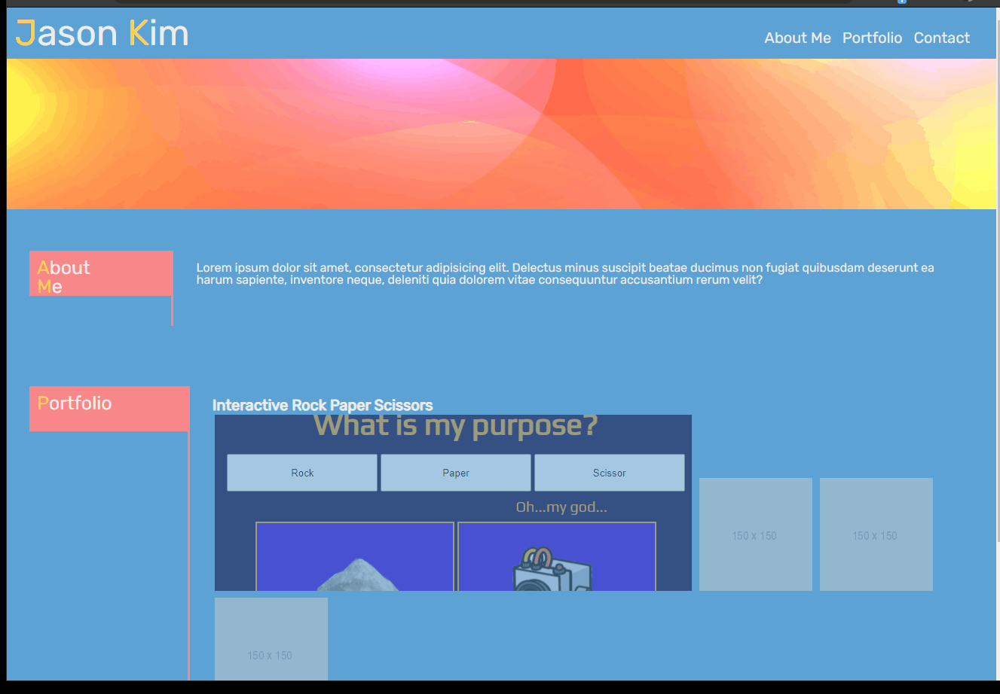

# Professional Profile

Profile page describing a bit about myself and showcasing each of my finished projects. Also includes contact information at the bottom.

## Demo

## Lessons Learned

Redo of my initial professional profile from HW2. Once I started conceptualizing each div, and any tags for that matter, as individual long and short rectangles, it was easier to visualize which elements needed to be manipulated to fit the style I am going for. HTML and CSS seems to be a lot more about trial and error, basically sketching out what I want to see, erasing, and redrawing until I get the exact layout I am looking for.
  
## Deployment

https://eccentricality.github.io/profProfile/

  